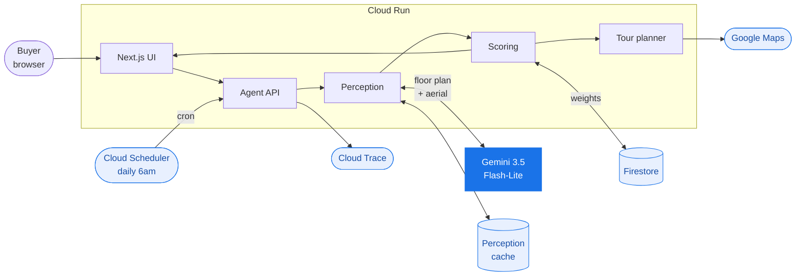

# VastuNest

An autonomous agent that reads floor plans and satellite images to find a house.

**Track:** Collaborative Partner · **All Things Agentic Hackathon**

| | |
|---|---|
| Live app | https://vastunest-ui-555426598641.us-central1.run.app |
| Health / proof | https://vastunest-agent-555426598641.us-central1.run.app/api/health |
| Model | `gemini-3.5-flash-lite` |
| Agent framework | Google GenAI SDK (`@google/genai`) |
| Google Cloud | Cloud Run · Firestore · Cloud Scheduler · Cloud Trace · Secret Manager |

---

## The problem

Zillow filters on price, beds and baths. It has no filter for the things that
actually rule a house out for us:

- Which direction the front door faces. That's Vastu, and it isn't negotiable in my family.
- Whether the ground-floor bathroom has a tub, or only a toilet and a sink.
- Whether the backyard is flat and fenced, or drops away into a drainage problem.
- Whether the lot backs onto a four-lane road.

None of that is a field in any listing feed. All of it is visible in the floor
plan and the satellite image. It's a vision problem, not a search problem.

We have toured 22 houses and still haven't bought one.

## What it does

Gemini reads the floor plan and the aerial photo and reports what it sees,
quoting the evidence for each claim. A TypeScript scoring engine, not the model,
turns that into a match score against a preference profile that updates as you
give it feedback.

| | |
|---|---|
| Reads drawings | Locates the entrance, kitchen quadrant, primary bedroom, and whether a main-floor bath contains a tub |
| Reads aerials | Yard grade, fencing, privacy, road adjacency |
| Scores deterministically | Same house, same number, every time |
| Enforces your non-negotiables | Hard constraints cap the score, so a nice house can't outrank a must-have |
| Learns from plain English | "It fronts a four-lane road, that's a dealbreaker with a toddler" becomes a weight change, saved to Firestore |
| Runs unattended | Cloud Scheduler triggers it each morning. It reads what's new and decides whether anything is worth reporting |
| Swappable rulebooks | Vastu and Feng Shui disagree: a south-facing entrance is a flaw in one, the ideal in the other |
| Plans the tour | Orders the stops by geography, times them, says what to check at each door, returns a Google Maps route |
| Reads plans it's never seen | Drop in any floor plan and the same pipeline runs |

## Architecture



The model is asked one question: what is physically in this drawing. It never
sees your preference weights and never produces a score. Because of that,
perception depends only on the images, so it is cached. A re-rank costs 23ms and
no model call, and switching from Vastu to Feng Shui re-ranks the whole list
without calling Gemini.

<sub>Source: [`docs/architecture.mmd`](docs/architecture.mmd)</sub>

## Quickstart

```bash
git clone https://github.com/skg0525/allthingsagentichackathon.git
cd allthingsagentichackathon

cd backend && npm install
cp .env.example .env          # add your GEMINI_API_KEY
npm run serve                 # http://localhost:8080

cd ../frontend && npm install
npm run dev                   # http://localhost:3000
```

The floor plans, aerials, and the agent's readings of them are all committed, so
a fresh clone scans in about 23ms with no API calls. Full setup, deployment and
API reference: **[docs/SETUP.md](docs/SETUP.md)**.

Deploy the whole thing to Google Cloud with one command:

```bash
./deploy/deploy.sh YOUR_PROJECT_ID
```

## Verify the main claim

The agent reads floor plans correctly, and you can check that yourself:

```bash
cd backend && npm run verify:seed    # offline, no API key needed
```

```
exact     39/42   93%
adjacent   3/42    7%     (one compass point out on a hand-drawn plan)
wrong      0/42    0%
```

The floor plans were generated from written specs, so the correct answer for
each one is known. Those answers live in `src/data/groundTruth.ts`, which no
runtime code imports. `npm run verify` runs the same scoring against live model
calls.

## Repo layout

```
backend/
  scripts/
    generateAssets.ts    generate the floor plan + aerial dataset (Gemini 3.1 Flash Image)
    optimizeAssets.ts    downscale and re-encode
    buildCache.ts        read every plan once, write the committed seed
    verifyAssets.ts      accuracy against ground truth, live model calls
    verifySeed.ts        same scoring, offline, milliseconds
  src/
    server.ts            Express, SSE scan, rate limits
    telemetry.ts         OpenTelemetry spans to Cloud Trace
    data/
      mockListings.ts    the shortlist. Deliberately holds no spatial truth
      incomingListings.ts  the feed the overnight agent pulls from
      traditions.ts      Vastu and Feng Shui as rule tables
      groundTruth.ts     the answer key, never imported at runtime
    services/
      geminiEvaluator.ts perception only. Model fallback chain, timeouts
      scoringEngine.ts   deterministic scoring and hard constraints
      watchAgent.ts      the autonomous cycle. Decides whether to notify
      tourPlanner.ts     orders stops, times them, builds the Maps route
      feedbackInterpreter.ts   free text to weight deltas
      memoryManager.ts   Firestore, with a local JSON fallback
      adhocAnalyzer.ts   analyse an uploaded, unseen floor plan
      narrator.ts        pros and cons, no extra model call
  public/assets/         the generated imagery
  data/                  the committed perception seed
frontend/src/            Next.js command center
deploy/                  deploy, demo reset, teardown
docs/                    setup, demo script, design notes
```

## Where to look

| To see | Open |
|---|---|
| The architectural argument | `geminiEvaluator.ts` (perception) against `scoringEngine.ts` (judgement) |
| The autonomous decision | `watchAgent.ts`, specifically `NOTIFY_THRESHOLD` and `notify` |
| Traditions as data | `data/traditions.ts` |
| Failure handling | `UNKNOWN_PERCEPTION` in `geminiEvaluator.ts`. Returns Unknown rather than a guess |
| Why it's fast | `auditService.ts`, the perception cache |

## Didn't fit in four minutes

- **The dataset regenerates.** `npm run assets` rebuilds every floor plan and
  aerial from written scene briefs using Gemini 3.1 Flash Image.
- **Upload any plan.** Yard fields come back Unknown, because a floor plan can't
  show you a backyard.
- **Two verification harnesses**, one live and one offline, sharing one answer key.
- **A model fallback chain.** `gemini-3.5-flash` was measured taking 59 seconds to
  return a 503 while flash-lite answered the same request in 1.5 seconds. The seed
  records which model produced each reading.
- **Spend controls.** Per-IP throttles, a daily model-call budget on `/api/health`,
  `max-instances=2`, and a teardown script.

## Findings & learnings

- **`thinkingLevel: LOW` roughly halved vision latency** with no measurable accuracy
  loss on the verification set. Reading a labelled drawing is a lookup task.
- **Thinking tokens draw from `maxOutputTokens`.** A 2048 budget silently truncated
  the 15-field response and returned empty bodies. 4096 fixed it.
- **Image size dominated latency.** Raw model output was ~1MB per image; two of
  those per request pushed calls past a 20s timeout. Downscaling cut the payload
  84% and made the calls reliable.
- **Firing 5 vision calls at once provoked 503s.** A concurrency pool of 2 was
  faster end-to-end than unbounded parallelism.
- **Separating perception from judgement was the highest-leverage decision.** It
  is what made caching safe, re-ranking free, the output reproducible, and the
  whole Vastu → Feng Shui swap possible without touching the model.
- **503 `UNAVAILABLE` is not 429 `RESOURCE_EXHAUSTED`.** Every failure we hit was
  the former — model capacity, not quota. Enabling billing does not fix it; a
  fallback chain does.
- **A preference change must never be able to trigger a model call.** Switching
  tradition on a cold cache used to kick off a full scan — about two minutes of
  vision calls for an action advertised as free. Re-scoring is now a distinct
  mode that skips anything not already read, and returns in ~24ms.
- **A cache clear that races a live scan is worse than no clear at all.** It
  reports success and then refills, so you believe the next run is live when it
  is not. `/api/cache/clear` now refuses while `activeScans > 0`.
- **The autonomous run needed a real decision, not a real schedule.** Wiring
  Cloud Scheduler is trivial; the part that makes it an agent is that it stays
  silent when nothing clears the bar.
- **Cloud Run throttles CPU to near zero between requests**, so OpenTelemetry's
  batch processor never fires its background timer and buffered spans die with
  the container. Flushing has to be driven by request traffic instead.
- **The Firestore client throws an *uncaught* exception when no credentials
  exist**, from a deferred gRPC stub creation outside any try/catch around the
  call. Credentials have to be checked before the client is constructed, or a
  clone without `gcloud auth` gets a server that exits seconds after boot.
- **The universal Google Maps URL beat the Directions API.** No key, no quota,
  no billing, and it opens natively in the Maps app on whatever phone scans it.
