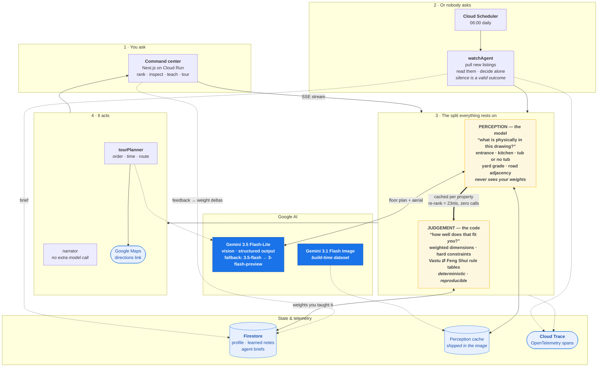

# VastuNest — an autonomous home-buying agent

**All Things Agentic Hackathon · Track: The Collaborative Partner**

**Live:** https://vastunest-ui-555426598641.us-central1.run.app · [health](https://vastunest-agent-555426598641.us-central1.run.app/api/health)

Zillow and Redfin let you filter on price, beds and baths. They have no filter for
the things that actually decide whether a family buys a house:

- Does the **main entrance face East or North**? (Vastu Shastra — a hard requirement in many Indian households)
- Is there a **real bedroom on the ground floor with a full bath**, not a study and a powder room?
- Is the **backyard flat and fenced**, or does it drop away into a drainage problem?
- Does it **back onto a four-lane road** you'd never let a toddler near?

Those facts are not in the structured listing data. They are in the **floor plan
drawing** and the **satellite image** — which is exactly where a multimodal agent
can go and a filter cannot.

VastuNest reads both, recovers the spatial facts, scores every property against a
preference profile it keeps learning, and re-ranks the list every time you tell it
something new.

---

## What it actually does

| | |
|---|---|
| **Reads floor plans** | Gemini 3.5 Flash locates the front door, the kitchen quadrant, the primary bedroom, and whether a main-floor bath contains a tub — citing the visual evidence for each claim. |
| **Runs without you** | Cloud Scheduler triggers an overnight cycle. The agent pulls what is new on the market, reads the floor plans unprompted, and decides for itself whether anything is worth waking you for. A quiet night is a valid outcome. |
| **Reads plans it has never seen** | Drop in any real floor plan — same model, same prompt, same rules. |
| **Plans the tour** | Pick a shortlist and it orders the stops by geography, allocates realistic time at each door, says what to verify in person given what it already found in the plans, and hands back a Google Maps route. |
| **Traces itself** | Every reasoning step exports to Cloud Trace as OpenTelemetry spans — auditable in Google's console, not just ours. |
| **Starts empty** | Nothing is scored until you ask. No precomputed grid — you watch the agent work. |
| **Reads aerials** | Recovers yard grade, fencing, privacy and road adjacency from top-down imagery. |
| **Scores deterministically** | Perception is the model's job; judgement is pure arithmetic in `scoringEngine.ts`. The same perception always yields the same score. |
| **Enforces non-negotiables** | Hard constraints cap the headline score, so a beautiful house can never outrank a must-have you told it about. |
| **Learns from plain English** | "It fronts a four-lane road, that's a dealbreaker with a toddler" becomes a concrete weight change, persisted, applied to every property. |
| **Swaps the rulebook** | Vastu and Feng Shui are data, not code. They genuinely disagree — a south-facing entrance is a Vastu flaw and the Feng Shui ideal — so switching re-orders the list without a single model call. |
| **Re-ranks for free** | Changing a preference or tradition re-scores from cached perception. No model call — 23ms, and it is structurally incapable of triggering one. |

### The architectural decision that matters

> **Gemini does perception. Code does judgement.**

The model is never shown the buyer's weights and never asked for a score. It only
answers *"what is physically in this drawing?"* That split buys three things:

1. **Reproducibility** — two runs over the same house give the same number, so
   comparing houses week over week means something.
2. **Auditability** — every claim ships with the evidence sentence the model used.
   Open the floor plan and check its work.
3. **Speed and cost** — perception depends only on the images, so it caches
   permanently. A first analysis costs one vision call per property; every
   re-rank after that costs zero.
4. **Pluggability** — because judgement is a table of numbers rather than a
   prompt, a whole cultural tradition can be swapped at runtime.

Measured on this repo: **re-rank 23ms, zero model calls.** First analysis
depends entirely on Google's API load that day — the identical request measured
1.5s in one window and 23s (or a 503) in another. That variance is why the
perception cache ships committed: a fresh clone is instant, and liveness is
proved on demand rather than gambled on.

### Traditions are data

`backend/src/data/traditions.ts` holds two directional rule sets:

| | Vastu Shastra | Feng Shui |
|---|---|---|
| Origin | Indian / Hindu architectural tradition | Chinese classical compass school |
| Best entrance | **East / North** | **South** ("bright hall") |
| Worst entrance | South, South-West | North-East, South-West ("devil's gates") |
| Best kitchen | South-East (Agni, fire corner) | East / South-East (Wood feeds Fire) |
| Best primary bed | South-West | North-West |

They are chosen precisely *because* they conflict. Switching tradition moves
`75 Trailview Court` from a compass score of **23 to 75 — fourth place to
first** — on the same house, the same floor plan and the same perception. Only
the rulebook changed, and no model call was made. The app never claims one system
is correct; it makes whichever one you hold explicit and auditable.

---

## Using it

### The screens

The app opens on a **brief** — the problem, your priorities, your non-negotiables,
and the candidates, none of them scored. Click **Analyze** and it becomes a
three-pane console: preferences on the left, ranked candidates in the middle, the
selected property on the right, and a docked **Teach the agent** bar along the
bottom.

### The buttons

| Button | What it does |
|---|---|
| **Analyze N properties** | The agent reads every floor plan and aerial and scores them. Live — about a minute. |
| **Re-read the plans** | Discard every cached reading and look again. Use it to verify the agent rather than trust what it read last time. |
| **Analyse a plan** | Drop in any floor plan the system has never seen. |
| **Start over** | Back to the brief with nothing scored. |

The timing readout tells you which kind of run happened:
`analyzed live in 18.4s` (Gemini actually read the images) versus
`re-scored in 23ms` (served from cached readings, no model call).

### Why there are two speeds

The agent's reading of a floor plan depends only on **the image**, never on your
preferences. So it is computed once per property and kept. Changing a weight,
switching tradition, or teaching it something new re-runs only the arithmetic.
That is why re-ranking is instant and free while the first analysis is not.

### Teaching it

Open **Teach the agent** at the bottom, pick 👍 or 👎, and write what you actually
think:

> *"It fronts a four-lane road. With a toddler that's an absolute dealbreaker,
> and the yard has no real fence."*

Gemini turns that into weight changes, shows you exactly what moved
(`community 0.75 → 0.95`), persists it, and re-ranks everything. Permanent, and
it applies to every future run — including the overnight ones.

### The overnight agent

Cloud Scheduler pings the agent every morning. It pulls what is new on the
market, reads each floor plan and aerial, and **decides on its own** whether
anything is worth telling you about. The result lands in **While you were away**.

A quiet night is a real outcome: if nothing clears 80/100 it files the run and
says nothing. Click any row in the brief to open that property — anything the
agent has surfaced joins your shortlist.

### Resetting for a demo

Close the VastuNest tab first, then:

```bash
./deploy/demo-reset.sh
```

It resets learned preferences, sets the tradition back to Vastu, wipes old
briefs, runs one overnight cycle so the brief has content, clears the perception
cache **last** so nothing refills it, then verifies no demo property is cached.
Exits non-zero if anything is off.

---

## Architecture



**Read it in one line:** the model answers *what is there*; the code decides *what
it means to you*. Everything good downstream — the 23ms re-rank, the swappable
tradition, the reproducible score, the fact that a claim can be checked against
the drawing — falls out of that one separation.

**Request path on a warm scan:** browser → SSE → cache hit → deterministic score →
narrative → stream out. No model call, no network egress, ~7ms per property.

---

## Tech stack

| Requirement | What we used |
|---|---|
| Gemini 3.5 or newer | `gemini-3.5-flash-lite` via the Google GenAI SDK (vision + structured output). Falls back to `gemini-3.5-flash`, then `gemini-3-flash-preview`. |
| Google agent framework | `@google/genai` (Google GenAI SDK) — structured `responseSchema`, `thinkingLevel`, system instructions. |
| Google Cloud infrastructure | **Cloud Run** (both services, `min-instances=0`), **Firestore** (buyer profiles + learned notes). |
| Bonus Google model | `gemini-3.1-flash-image` generates the floor plan and aerial dataset at build time. |
| Frontend | Next.js 16 (App Router), Tailwind v4, Lucide. |

---

## Spin-up

### Prerequisites
- Node.js 22+
- A Gemini API key — <https://aistudio.google.com/apikey>

### 1. Backend

```bash
cd backend
npm install
cp .env.example .env      # then put your real GEMINI_API_KEY in .env
npm run serve
```

The agent starts on <http://localhost:8080>. Check it:

```bash
curl http://localhost:8080/api/health
```

Without Google Cloud credentials the memory layer falls back to a local JSON file
and says so in `memoryBackend`. Nothing breaks.

### 2. Imagery and perception ship with the repo

`backend/public/assets/` holds the floor plans and aerials, and
`backend/data/perception-seed.json` holds what the agent read from them. **You do
not need to generate either** — clone and run, and the first scan returns in
about 36ms.

That is deliberate. Vision latency is Google's and it swings hard: the identical
two-image request measured 1.5s in one window and 23s (or a 503) in another. A
first-run experience should not be a coin flip on someone else's capacity.

Liveness is still provable on demand — **Re-read the plans** discards the seed
and calls the model for real, and `npm run verify` replays every reading against
known ground truth.

To rebuild either from scratch:

```bash
cd backend
npm run assets            # regenerate imagery (24 files, resumable)
npm run assets:optimize   # downscale + re-encode
npm run cache:build       # re-read every plan and rewrite the seed
```

<details>
<summary>Only if the imagery is missing</summary>

The floor plans and aerials are generated by Gemini and committed to the repo. If
`backend/public/assets/` is empty:

```bash
cd backend
npm run assets            # 24 images, resumable — re-run to pick up any that failed
npm run assets:optimize   # ~17MB -> ~3MB
```

The image models return HTTP 503 under load fairly often. That is Google-side
capacity, not your quota — the generator falls through a chain of image models
and retries in rounds, and re-running only fills whatever is still missing.

</details>

### 3. Frontend

```bash
cd frontend
npm install
npm run dev
```

Open <http://localhost:3000>. The app opens **empty on purpose** — nothing is scored until you click
*Analyze*, so you can see the agent actually working. The first run makes live
vision calls (~50s, streaming in as each resolves) and caches; every run after
that is instant.

### 4. Verify the agent actually reads plans

Every image was generated from a written brief, so the ground truth is known:

```bash
cd backend
npm run verify
```

Two harnesses, same ground truth (`src/data/groundTruth.ts`), same scoring:

| | |
|---|---|
| `npm run verify` | **Live.** Re-reads every plan through the model. The honest end-to-end check, but its wall time is at the mercy of Google's capacity. |
| `npm run verify:seed` | **Offline.** Scores the readings committed in the repo, in milliseconds, no API calls. Makes the claim reproducible by anyone. |

Both fail the build if more than 15% of fields are outright wrong. Current
result across 8 properties and 42 fields:

```
  exact    39/42  93%
  adjacent  3/42   7%     (e.g. read "North" where the brief said "North-East")
  wrong     0/42   0%
  models   gemini-3.5-flash-lite×7, gemini-3-flash-preview×1
```

The three adjacent calls are one compass point out on a hand-drawn plan — the
kind of disagreement two surveyors would have. **Nothing was read backwards.**
One property fell through to the fallback model when the primary was saturated;
the seed records which model produced each reading, so that is auditable rather
than hidden.

---

## Deploy to Google Cloud

**One command:**

```bash
./deploy/deploy.sh YOUR_PROJECT_ID
```

That enables the APIs, creates Firestore, stores the Gemini key in Secret
Manager, deploys both Cloud Run services at `min-instances=0`, wires CORS, and
creates the Cloud Scheduler job that drives the autonomous overnight agent.

<details>
<summary>Or step by step</summary>

```bash
gcloud config set project YOUR_PROJECT_ID
gcloud services enable run.googleapis.com firestore.googleapis.com aiplatform.googleapis.com
```

Store the key in Secret Manager rather than an env var:

```bash
echo -n "YOUR_GEMINI_API_KEY" | gcloud secrets create gemini-api-key --data-file=-
```

Deploy the agent:

```bash
cd backend
gcloud run deploy vastunest-agent \
  --source . \
  --region us-central1 \
  --allow-unauthenticated \
  --min-instances 0 \
  --memory 1Gi \
  --set-secrets GEMINI_API_KEY=gemini-api-key:latest \
  --set-env-vars GOOGLE_CLOUD_PROJECT=YOUR_PROJECT_ID
```

Create the Firestore database once:

```bash
gcloud firestore databases create --location=nam5
```

Deploy the frontend against the agent URL:

```bash
cd frontend
gcloud run deploy vastunest-ui \
  --source . \
  --region us-central1 \
  --allow-unauthenticated \
  --min-instances 0 \
  --set-env-vars NEXT_PUBLIC_API_BASE=https://vastunest-agent-XXXX.run.app
```

Then the scheduler that makes it autonomous:

```bash
gcloud scheduler jobs create http vastunest-overnight \
  --location us-central1 \
  --schedule "0 6 * * *" \
  --time-zone "America/New_York" \
  --uri "https://vastunest-agent-XXXX.run.app/api/agent/run?trigger=schedule" \
  --http-method POST
```

</details>

`min-instances 0` means both services scale to zero and cost nothing at idle —
the scheduler wakes the agent once a day and it goes back to sleep.

---

## API

| Method | Path | Purpose |
|---|---|---|
| `GET` | `/api/health` | Model, memory backend, cache size, Cloud Run revision |
| `GET` | `/api/listings` | Candidate set |
| `GET` | `/api/traditions` | Available directional rule sets + their explanations |
| `POST` | `/api/agent/run` | **The autonomous cycle.** What Cloud Scheduler calls. Idempotent. |
| `GET` | `/api/agent/briefs` | What the agent found on past unattended runs |
| `POST` | `/api/agent/reset` | Clear briefs + the seen list (demo reset) |
| `POST` | `/api/analyze/plan` | Analyse an uploaded floor plan the system has never seen |
| `POST` | `/api/tour/plan` | Order a shortlist into a drivable route + Google Maps link |
| `GET` | `/api/scan` | **SSE** — audits stream as each resolves |
| `POST` | `/api/audit/:id` | Single property |
| `GET` | `/api/profile` | Buyer preference profile |
| `PATCH` | `/api/profile` | Adjust weights, constraints or tradition (triggers a free re-rank) |
| `POST` | `/api/feedback` | Free-text critique → interpreted weight change |
| `POST` | `/api/cache/clear` | Drop cached perception, forcing live vision calls. Returns 409 while a scan is streaming, since clearing into a moving target silently refills. |

---

## Repo layout

```
backend/
  scripts/
    generateAssets.ts     Gemini image generation, model fallback chain
    optimizeAssets.ts     downscale + re-encode (10.5MB -> 1.7MB)
    verifyAssets.ts       perception accuracy harness vs. known ground truth
  src/
    server.ts             Express 5, SSE scan, concurrency pool
    data/mockListings.ts  curated set — deliberately holds NO spatial truth
    data/traditions.ts    Vastu + Feng Shui rule tables (pure data)
    data/incomingListings.ts  the market feed the overnight agent pulls from
    services/
      geminiEvaluator.ts  perception only, model fallback, timeout + retry
      scoringEngine.ts    deterministic weighted scoring + hard constraints
      narrator.ts         pros/cons/summary, zero extra model calls
      feedbackInterpreter.ts  free text -> weight deltas
      memoryManager.ts    Firestore with local JSON fallback
      watchAgent.ts       the autonomous cycle — runs on a cron, decides alone
      briefStore.ts       append-only log of unattended runs
      adhocAnalyzer.ts    analyse an uploaded, never-before-seen floor plan
      tourPlanner.ts      order a shortlist geographically, time it, route it
    telemetry.ts          OpenTelemetry spans exported to Cloud Trace
  public/assets/          generated floor plans, aerials, exteriors
frontend/
  src/components/         command center UI
  src/lib/api.ts          typed client incl. the SSE reader
```

## Keeping the bill at zero

Cloud Run bills for request time only. With `min-instances=0` an idle service
costs nothing at all — not a rounding error, nothing.

What *can* cost money, in order of actual risk:

| | Risk | Control |
|---|---|---|
| **Gemini API calls** | The real one. Vision on images is the expensive part. | Perception cache (a re-rank costs zero), per-IP throttles, and a hard `DAILY_MODEL_CALL_BUDGET` |
| Cloud Run compute | Tiny. Scales to zero, capped at 2 instances. | `min-instances=0`, `max-instances=2` |
| Cloud Build | ~$0 — first 120 build-minutes/day are free. | n/a |
| Cloud Scheduler | **Free.** 3 jobs/month per billing account; this uses 1. | n/a |
| Firestore | Free tier covers this by orders of magnitude. | n/a |

The scheduled 6am run is the only thing that happens unattended. It reads at
most 2 new listings, so **one Gemini call each — about two model calls a day.**

### Budget alerts do not stop spending

This is the part people get wrong. A GCP budget is a **notification**, not a cap.
Setting one is still worth doing, but if you want a hard guarantee:

```bash
# The actual off switch — deletes both services and the scheduler.
./deploy/teardown.sh YOUR_PROJECT_ID
```

The rules do not require the app to be live at judging, so tearing it down right
after you record is the safest option and costs you nothing in the submission.

To cap the Gemini side specifically, set a spend limit on the API key in AI
Studio, and lower `DAILY_MODEL_CALL_BUDGET` on the service:

```bash
gcloud run services update vastunest-agent --region us-central1 \
  --update-env-vars DAILY_MODEL_CALL_BUDGET=100
```

## Cost and abuse controls

A public `.run.app` URL is world-reachable, and every interesting route can cost
a model call. Four layers, all visible on `/api/health`:

| Control | Setting |
|---|---|
| Idle cost | `min-instances=0` — nothing runs, nothing bills |
| Blast radius | `max-instances=2`, concurrency 20 |
| Per-IP throttle | 12 scans/min · 6 plan uploads/min · 15 feedbacks/min · 4 agent runs/5min |
| Daily spend cap | `DAILY_MODEL_CALL_BUDGET` (default 400) per instance, enforced in-process and charged only for work that actually happened |

Caching does most of the real work: a re-rank makes **zero** model calls, so the
common interaction is free no matter how often it is hit.

`./deploy/teardown.sh PROJECT_ID` removes both services and the scheduler when
you are done. The rules do not require the app to be live at judging time.

## Findings & learnings

- **`thinkingLevel: LOW` roughly halved vision latency** with no measurable accuracy
  loss on the verification set. Reading a labelled drawing is a lookup task.
- **Thinking tokens draw from `maxOutputTokens`.** A 2048 budget silently truncated
  the 15-field response and returned empty bodies. 4096 fixed it.
- **Image size dominated latency.** Raw model output was ~1MB per image; two of
  those per request pushed calls past a 20s timeout. Downscaling cut the payload
  84% and made the calls reliable.
- **Firing 5 vision calls at once provoked 503s.** A concurrency pool of 2 was
  faster end-to-end than unbounded parallelism.
- **Separating perception from judgement was the highest-leverage decision.** It
  is what made caching safe, re-ranking free, the output reproducible, and the
  whole Vastu → Feng Shui swap possible without touching the model.
- **503 `UNAVAILABLE` is not 429 `RESOURCE_EXHAUSTED`.** Every failure we hit was
  the former — model capacity, not quota. Enabling billing does not fix it; a
  fallback chain does.
- **A preference change must never be able to trigger a model call.** Switching
  tradition on a cold cache used to kick off a full scan — about two minutes of
  vision calls for an action advertised as free. Re-scoring is now a distinct
  mode that skips anything not already read, and returns in ~24ms.
- **A cache clear that races a live scan is worse than no clear at all.** It
  reports success and then refills, so you believe the next run is live when it
  is not. `/api/cache/clear` now refuses while `activeScans > 0`.
- **The autonomous run needed a real decision, not a real schedule.** Wiring
  Cloud Scheduler is trivial; the part that makes it an agent is that it stays
  silent when nothing clears the bar.
- **Cloud Run throttles CPU to near zero between requests**, so OpenTelemetry's
  batch processor never fires its background timer and buffered spans die with
  the container. Flushing has to be driven by request traffic instead.
- **The Firestore client throws an *uncaught* exception when no credentials
  exist**, from a deferred gRPC stub creation outside any try/catch around the
  call. Credentials have to be checked before the client is constructed, or a
  clone without `gcloud auth` gets a server that exits seconds after boot.
- **The universal Google Maps URL beat the Directions API.** No key, no quota,
  no billing, and it opens natively in the Maps app on whatever phone scans it.
